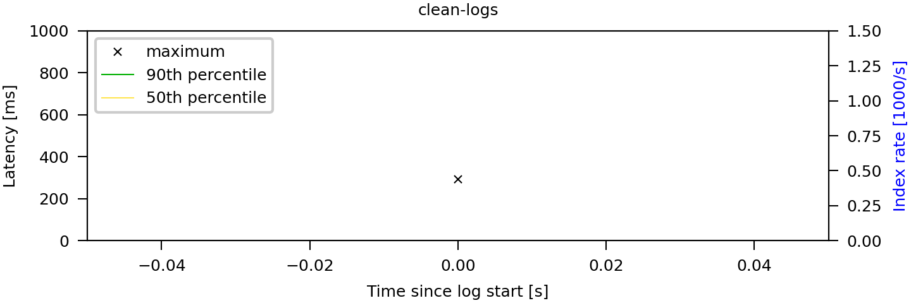

Monitoring the Internet Computer (Evaluation Artifact)
======================================================

Synopsis
--------

This artifact accompanies the paper "Monitoring the Internet Computer", which
will be presented at the 25th International Symposium on Formal Methods
(FM 2023). It provides the policy formulas described in Section 3.2 of the
paper, the raw log files that were used in the evaluation, and all tools
necessary to reproduce the experimental results, specifically those reported in
Table 2 and Figure 5 in the paper.

The remainder of this file is organized as follows:

1. Overview of the [artifact files](#Overview)
2. Instructions for [setting up the experiments](#Setup)
3. Instructions for [reproducing the experiments](#Reproduction)


Overview of the Artifact Files <a name="Overview"></a>
------------------------------------------------------

The archive `ic-monitoring-benchmark.tar` contains a ready-to-use docker image
with all tools and dependencies preinstalled. See the section on reproduction
below for instructions.

The docker image does not embed the raw log files because of their size.
They are provided separately in the `data` folder, specifically:

- `data/production.raw.log`: The three hour fragment of the production log.
- `data/mercury-reg-snap--20220905_212707.json`: Snapshot of the IC's registry
  state at the begin of the production log.
- `data/system-tests/*.raw.log`: Logs from three runs of every hourly and
  nightly system test. The file names have a numeric suffix that distinguishes
  the different runs; the rest of the name identifies the system test.

Each raw log file contains a single array (in Python format) with the log entries
 from IC nodes.

By following the instructions below, the folder that contains this readme file
is mounted as a volume within the docker container. All scripts in the
`policy-monitoring` and `experiment` subfolders are directly executed from this
volume and can thus be edited without rebuilding the docker image. In addition,
we provide the sources that were used to build the image to simplify the
inspection of the artifact, as well as to facilitate reuse and extensions. If
desired, the image can be rebuilt by running `docker build -t
ic-monitoring-benchmark`.

### Summary of the remaining files

- `monpoly/`: Source code (OCaml) of the MonPoly monitoring tool. This is a copy
  of commit f2825be8fa1a0684dd0eb1da8c6f5cd87724d0f2 from
  <https://bitbucket.org/jshs/monpoly.git>.

- `replayer/`: Source code (Java/Scala) of the real-time log stream simulator
  used in the online monitoring experiments. This is a copy of commit
  da7a2e6fee3d68adec70e864ba0152092a94fad9 from
  <https://bitbucket.org/krle/scalable-online-monitor.git>. The main program can
  be found in `replayer/src/main/java/ch/ethz/infsec/replayer/Replayer.java`.

- `policy-monitoring/`: The monitoring pipeline that we developed for the IC.
  - `mfotl-policies/`: The formalized policies, see below for details.
  - `monpoly/`: Python wrapper around MonPoly.
  - `pipeline/`: Contains the log preprocessor.
  - `main.py`: Entry point for running the pipeline.

- `experiments/`: Scripts that prepare, execute, and summarize our performance
  experiments.
  - `entrypoints/*.sh`: Driver scripts, see below.
  - `simulate_online.sh`: Combines MonPoly and the real-time stream simulator
    (a.k.a. replayer). Additionally, a text file reporting the replayer latency
    at every second is produced.
  - `index_rate.mfotl`: MFOTL formula used to compute the index rate of the
    production log.
  - `make_online.py`: Adjusts the time-stamps of the initial registry state in
    the preprocessed production log to be shortly before the first proper event.
    Without this change, the replayer would introduce an excessive delay.
  - `make_table.py`: Reads the statistics collected by the monitoring pipeline
    and aggregates them to produce Table 2 from the paper.
  - `make_plot.py`: Reads the replayer latency reports and produces Figure 5.
  - `requirements.txt`: Python dependencies, including those of the monitoring
    pipeline.

- `test-inputs`: Log files to quickly test the experiment scripts, as explained
  below.

- `Dockerfile`: For building the docker image.

### Policy formulas

We provide formalizations of all policies described in the paper. There is
a folder in `policy-monitoring/mfotl-policies` for every policy. Each folder
contains an MFOTL formula, expressed using MonPoly's concrete syntax, as well as
satisfying and violating example logs for testing. The MFOTL files include
OCaml-style comments that explain the formula in more detail.

Most aspects of the concrete formula syntax are described in the paper *The
MonPoly Monitoring Tool* (David Basin, Felix Klaedtke, Eugen Zalinescu. RV-CuBES
2017: 19-28 <https://doi.org/10.29007/89hs>). Let operators are a more recent
feature, which were introduced to MFOTL by the paper *Verified First-Order
Monitoring with Recursive Rules* (Sheila Zingg, Srdan Krstic, Martin Raszyk,
Joshua Schneider, Dmitriy Traytel. TACAS 2022: 236-253
<https://doi.org/10.1007/978-3-030-99527-0_13>).


Setting up the Experiments <a name="Setup"></a>
-----------------------------------------------

Our artifact is shipped as a Docker image; we therefore assume that the user has
Docker installed on their host system.

We tested the artifact on a system running Linux 5.4.0 (Docker version 20.10.21,
build `baeda1f`), but other OS supporting Docker should also work.

### System requirements

- **CPU:** We tested the artifact on a server with two 3 GHz 16-core AMD EPYC
  7302 CPUs.
- **RAM:** 180 GiB (!) for running the full set of experiments. **Note** 8 GiB
  of RAM is sufficient for running a reduced set of representative experiments.
- **Disk space:** At least 95 GiB of free disk space, of which ca. 65 GiB is
  the (uncompressed) artifact.
- **Time:** Approximately 15 minutes for setup. See the table below for the time
  estimates for each experiment group. The experiment groups are independent and
  represent different subsets of results in the paper (you may pick a subset of
  groups for reproduction).

| Experiment group                                             | Time (hours) |
|--------------------------------------------------------------|--------------|
| 1a (subset of offline monitoring, system tests only)         | 1            |
| 1b (subset of offline monitoring, system tests + production) | 4.5          |
| 2 (subset of online monitoring)                              | 5            |
| 3 (all offline monitoring experiments)                       | 20           |
| 4 (all online monitoring experiments)                        | 10           |

Note: The offline and online experiments produce outputs in disjoint directories
and thus can be started concurrently (assuming that the user's system has enough
resources). Therefore, it should be possible to reproduce the reduced set
(groups 1b and 2) within 5 hours and the full experiments (groups 3 and 4)
within 13 hours.

### Preparation

1. Open a shell on the system that should run the experiments and change the
   working directory to a location that has enough free disk space as indicated
   above in the requirements. We assume that a Bash shell under Linux is used.
   If you do not use Bash, you might need to adjust the commands below.
2. Execute the commands

        mkdir ic-monitoring-benchmark
        cd ic-monitoring-benchmark

   to create and change into a new folder that will hold the artifact (the
   folder must not exist yet).
3. Download the artifact archive <https://doi.org/10.5281/zenodo.7340850> and
   put the archive under the name `ic-monitoring-benchmark.zip` into the folder
   that you have just created.
4. Unpack the archive using the command `unzip ic-monitoring-benchmark.zip`.
5. Execute the command `docker load -i ic-monitoring-benchmark.tar` to import
   the docker image.
6. Execute the command

        docker run -itv `pwd`:/work localhost/ic-monitoring-benchmark

   to start the container, mounting the current working directory. Note that pwd
   must be enclosed in backticks. If the command fails with an error, try

        docker run -itv `pwd`:/work ic-monitoring-benchmark

   instead.

You are now in a Bash session running in the container. **All commands in the
following sections must be executed within the container.** You can leave the
container shell with `exit`.

Note that all files being created are also accessible from outside of the
container, thanks to the mounted volume. Therefore, they persist when the
current container is stopped and a new one is started.

### Setup validation

Please follow steps A-C below to validate that the artifact is set up correctly.

**Note:** the instructions in this section are intended for validating that this
artifact is _functional_. The validation steps will take a short time to
execute, but the data produced by running these validation steps does not
represent our paper's results. For reproducing the actual paper experiments,
please follow the [instructions](#Reproduction) _after_ this section.

#### A. Validating the offline monitoring benchmark (based on **system test logs**)

Run the following commands to validate the offline monitoring experiment based
on (a small subset of) the system test logs.

    rm -fr data/offline/
    ./experiments/entrypoints/offline-monitoring-system-tests.sh -l ./test-inputs/system-tests
    cat data/offline/results.txt

Expected outcome:

```
---------------------------------------------------------------------------------
Measurement               | Testing                   | Prod                     
---------------------------------------------------------------------------------
Raw log entries           |     1900    (   13851   ) |      nan    (     nan   )
Raw log size              |        2.8  (      26.3 ) |        nan  (       nan )
Processed events          |       19    (    1394   ) |      nan    (     nan   )
Processed events/s        |       10.2  (      28.7 ) |        nan  (       nan )
Processed log size        |        0.0  (       0.5 ) |        nan  (       nan )
Preprocessor time         |        0.07 (       0.11) |         nan (        nan)
---------------------------------------------------------------------------------
clean_logs                | 18.28 (  26.6)    9 (  10) |  nan (   nan)  nan ( nan)
logging_behavior__exe     | 18.03 (  24.3)   10 (  12) |  nan (   nan)  nan ( nan)
unauthorized_connections  | 18.17 (  25.6)    9 (  11) |  nan (   nan)  nan ( nan)
reboot_count              | 18.16 (  24.9)    9 (  10) |  nan (   nan)  nan ( nan)
finalization_consistency  | 17.48 (  24.7)    9 (  10) |  nan (   nan)  nan ( nan)
finalized_height          | 17.74 (  24.8)   10 (  10) |  nan (   nan)  nan ( nan)
replica_divergence        | 17.60 (  24.4)    9 (  10) |  nan (   nan)  nan ( nan)
block_validation_latency  | 17.47 (  25.3)   10 (  15) |  nan (   nan)  nan ( nan)
---------------------------------------------------------------------------------
```

The `nan` values above are _expected_ since the production experiments were not
invoked. The times and memory usages might be slightly different due to
variations in the environment.

Recall that the data produced by running this validation step does not represent
our paper's results.

#### B. Validating the offline monitoring benchmark (based on **production logs**)

Run the following commands to validate the offline monitoring experiment (for
our simplest policy, `clean_logs`) based on (a small prefix of) the production
logs.

    rm -fr data/offline/
    ./experiments/entrypoints/offline-monitoring-production.sh -l ./test-inputs/production/mainnet-3h-filtered-top100.raw.log
    cat data/offline/results.txt

Expected outcome:

```
---------------------------------------------------------------------------------
Measurement               | Testing                   | Prod                     
---------------------------------------------------------------------------------
Raw log entries           |      nan    (     nan   ) |      100    (     100   )
Raw log size              |        nan  (       nan ) |        0.4  (       0.4 )
Processed events          |      nan    (     nan   ) |     1323    (    1323   )
Processed events/s        |        nan  (       nan ) |    52920.0  (   52920.0 )
Processed log size        |        nan  (       nan ) |        0.2  (       0.2 )
Preprocessor time         |         nan (        nan) |        4.30 (       4.30)
---------------------------------------------------------------------------------
clean_logs                |  nan (   nan)  nan ( nan) | 0.36 (   0.4)   11 (  11)
---------------------------------------------------------------------------------
```

Again, the `nan` values in the above table are _expected_, the numbers might be
slightly different, and the data does not represent our paper's results.

#### C. Validating the **online** monitoring benchmark

Run the following commands to validate the online monitoring experiment (for our
simplest policy, `clean_logs`) based on (a small prefix of) the production logs.

    rm -fr data/online/
    ./experiments/entrypoints/prepare.sh -l ./test-inputs/production/mainnet-3h-filtered-top100.raw.log
    ./experiments/entrypoints/online-monitoring.sh clean_logs

The expected output graphic in `data/online/latency.png` should look like this:



Recall that this does not represent our paper's results.


Reproducing the paper experiments <a name="Reproduction"></a>
-------------------------------------------------------------

Please make sure to follow the [setup instructions](#Setup) first.

### Reproducing a representative subset of experiments

The following instructions perform a representative subset of the experiments,
which requires fewer resources (specifically RAM and time) than the full set.
Unlike in the setup validation instructions, this results in measurements that
are comparable to those obtained from the full benchmark; the only difference is
that some measurements are missing.

#### Experiment group 1: Offline monitoring benchmark

Either execute the commands (group 1a)

    rm -fr data/offline/
    ./experiments/entrypoints/offline-monitoring-system-tests.sh clean_logs reboot_count

**or** the commands (group 1b; requires more time, produces more results)

    rm -fr data/offline/
    ./experiments/entrypoints/offline-monitoring-system-tests.sh clean_logs reboot_count
    ./experiments/entrypoints/offline-monitoring-production.sh clean_logs reboot_count

Once the last script has finished, a subset of the results corresponding to
Table 2 in the paper can be found in `data/offline/results.txt`. You can
display the file with

    cat data/offline/results.txt

Specifically, the table contains the performance measurements for the
`clean_logs` and `reboot_count` policies. The table's structure and the units
are the same as in the paper.

#### Experiment group 2: Online monitoring benchmark

Execute the commands

    rm -fr data/online/
    ./experiments/entrypoints/prepare.sh
    ./experiments/entrypoints/online-monitoring.sh clean_logs

Once the last script has finished, the first subplot of Figure 5 in the paper
can be found in `data/online/latency.png`.


### Reproducing the full set of experiments from the paper

**Warning:** This requires 180 GiB of RAM and takes more than a day to complete.

Execute the commands

#### Experiment group 3: Offline monitoring benchmark

    rm -fr data/offline/
    ./experiments/entrypoints/offline-monitoring-system-tests.sh
    ./experiments/entrypoints/offline-monitoring-production.sh

and

#### Experiment group 4: Online monitoring benchmark

    rm -fr data/online/
    ./experiments/entrypoints/prepare.sh
    ./experiments/entrypoints/online-monitoring.sh

Once the last script has finished, the results corresponding to Table 2 in the
paper can be found in `data/offline/results.txt`. You can display the file with

    cat data/offline/results.txt

The table's structure and the units are the same as in the paper. The plot
corresponding to Figure 5 in the paper can be found in
`data/online/latency.png`.
